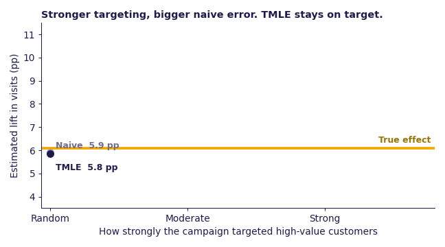
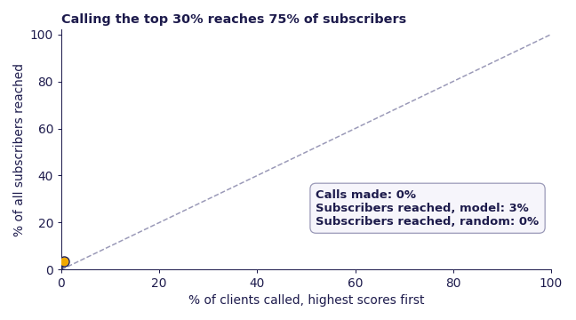
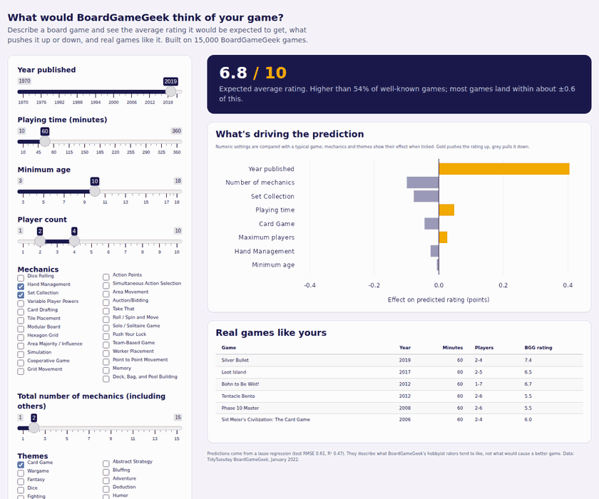

# Hi, I'm Juliet 👋

I'm a **PhD researcher in Statistics** at the University of Edinburgh, working at the intersection of causal inference, machine learning, and large-scale health data. My research focuses on estimating causal effects from observational healthcare and genomic data, specifically applying Collaborative Targeted Maximum Likelihood Estimation (C-TMLE) to the UK Biobank.

Before my PhD, I spent 4+ years as a data scientist and analyst, delivering data-driven insights for multinational clients including Microsoft, Unilever, P&G, and Betway. I love bridging the gap between rigorous statistical methodology and real-world impact.

---

## 🔬 What I Work On

- **Causal Inference** - TMLE, C-TMLE, IPW, propensity score methods
- **Statistical Modelling** - high-dimensional regression, semiparametric efficiency theory
- **Machine Learning** - LASSO/elastic net, SuperLearner, ensemble methods
- **Data Visualisation** - ggplot2, Tableau, Power BI, Looker
- **Health & Genomic Data** - Dataloch, DecodeME, UK Biobank, observational study design, missing data

---

## 🛠️ Tech Stack

---

## 📂 Featured Projects

### 🧬 [Causal Inference in High-Dimensional Observational Data](https://github.com/Asantewaah/causal-inference-simulation)

A comparative simulation study benchmarking TMLE and C-TMLE estimators across low- and high-dimensional settings. Built entirely in R using `glmnet`, `SuperLearner`, and influence function-based inference. Motivated by my PhD research on causal effect estimation in genomic data.

`R` `TMLE` `C-TMLE` `glmnet` `Causal Inference` `Simulation`

### 🔧 [TMLE.jl — Open Source Contributor](https://github.com/TARGENE/TMLE.jl)

Actively extending `TMLE.jl` - a Julia package for Targeted Minimum Loss-Based Estimation published in the *Journal of Open Source Software* (2025), by integrating **Collaborative TMLE (C-TMLE) estimators** into the package. Successfully implemented Lasso C-TMLE with bootstrap simulation studies and test coverage. Developed in collaboration with the TARGENE research group at the University of Edinburgh.

`Julia` `TMLE` `C-TMLE` `Causal Inference` `Open Source` `Research Software`

---

## 📊 Applied Data Science

<table>
<tr>
<td width="50%" valign="top">

**[Did the email campaign actually work?](https://github.com/Asantewaah/email-campaign-causal-impact)**

When a campaign targets its best customers, a naive comparison overstated the email's impact by **about 60%**. Checked against a real randomised experiment on 64,000 customers, AIPW and TMLE (implemented from scratch) recover the true effect with honest 95% intervals.

`Python` `TMLE` `AIPW` `Marketing`

</td>
<td width="50%" valign="top">

**[Who should the bank call?](https://github.com/Asantewaah/marketing-financial-analytics)**

On 41,188 real bank calls, targeting the top-scored 30% of clients wins **2.5× the subscriptions** of random calling on the same budget, keeping 93% of the profit with 70% fewer calls. Explained with SHAP and stress-tested on a time-based split.

`Python` `XGBoost` `SHAP` `Finance`

</td>
</tr>
<tr>
<td width="50%" valign="top">

**[What makes a board game highly rated?](https://github.com/Asantewaah/boardgame-ratings)**

An R analysis of 15,249 BoardGameGeek games, with a [**live Shiny app**](https://asantewaah.github.io/boardgame-ratings/) that runs in the browser via WebAssembly. Release year is the strongest predictor, and many popular mechanics lose their advantage once year and length are held constant.

`R` `tidyverse` `glmnet` `ranger` `Shiny`

</td>
<td width="50%" valign="top">

</td>
</tr>
</table>

---

## 📚 Currently

- 🎓 PhD in Statistics - University of Edinburgh *(causal inference, missing data, UK Biobank)*
- 🔧 Integrating C-TMLE estimators into [`TMLE.jl`](https://github.com/TARGENE/TMLE.jl) *(Lasso C-TMLE implemented & tested)*
- 📖 Reading: *What If* by Hernán & Robins *(the causal inference bible)*

---

## 📫 Get In Touch

I'm always happy to connect — whether it's about causal inference, data science, or potential collaborations.

---

*"Data is not just numbers, it's the story of people's lives."*
